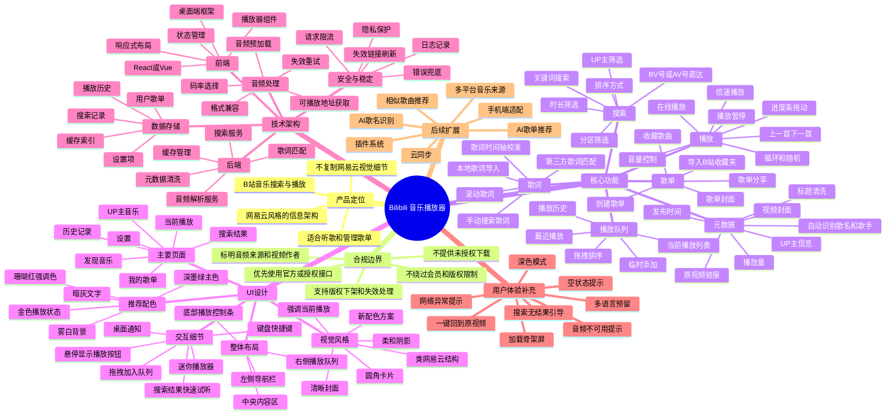

# Bilibili 音乐播放器设计方案

## 项目概述

本项目计划设计一款基于 Bilibili 音乐内容搜索与播放的桌面音乐播放器。软件整体交互结构参考网易云音乐的使用习惯，采用左侧导航、中央内容区、右侧播放队列和底部播放控制条的布局方式，但在视觉风格、内容组织和产品定位上突出 B 站音乐发现能力。

播放器的核心目标是：让用户可以通过关键词、BV 号、UP 主等方式从 Bilibili 搜索音乐相关内容，获取可播放音频，并以接近传统音乐播放器的方式进行播放、收藏、管理和浏览。

## 产品定位

- 面向喜欢在 Bilibili 搜索音乐、翻唱、Live、OST、二创音乐和电台内容的用户。
- 提供比网页端更专注的听歌体验。
- 保留 B 站内容特色，例如 UP 主、视频封面、投稿时间、播放量和原视频链接。
- UI 借鉴网易云音乐的信息架构，但避免直接复制其视觉风格。
- 兼顾搜索、播放、收藏、歌单管理和历史记录。

## 合规与边界

在设计和开发时，需要特别注意平台规则与版权问题：

- 优先使用官方或授权接口。
- 不绕过会员、付费、版权或地区限制。
- 不提供未授权的音频下载能力。
- 清晰标明音频来源、视频标题、UP 主和原视频链接。
- 当内容失效、下架或不可播放时，应及时提示用户。
- 对请求频率进行限制，避免对平台造成异常访问压力。

## 核心功能

### 搜索功能

- 支持关键词搜索。
- 支持 BV 号或 AV 号直达。
- 支持按 UP 主筛选。
- 支持按视频时长筛选。
- 支持按分区筛选，例如音乐、翻唱、原创音乐、鬼畜、影视剪辑等。
- 支持按相关度、发布时间、播放量等方式排序。
- 支持搜索历史记录。

### 播放功能

- 在线音频播放。
- 播放、暂停、上一首、下一首。
- 进度条拖动。
- 音量控制。
- 倍速播放。
- 单曲循环、列表循环、随机播放。
- 音频预加载。
- 播放失败自动重试或提示。

### 播放队列

- 展示当前播放列表。
- 支持临时添加歌曲。
- 支持拖拽调整播放顺序。
- 支持从搜索结果快速加入队列。
- 支持清空队列。
- 支持查看最近播放。

### 歌单系统

- 创建、编辑和删除歌单。
- 收藏搜索结果中的音乐。
- 支持歌单封面。
- 支持歌单描述。
- 支持从 B 站收藏夹导入内容。
- 支持歌单分享能力的后续扩展。

### 元数据管理

- 展示视频标题。
- 展示 UP 主名称。
- 展示视频封面。
- 展示投稿时间。
- 展示播放量。
- 提供原视频链接。
- 自动尝试识别歌名和歌手。
- 支持用户手动修正歌名、歌手和专辑信息。

### 歌词功能

- 支持手动搜索歌词。
- 支持第三方歌词匹配。
- 支持本地歌词导入。
- 支持滚动歌词。
- 支持歌词时间轴校准。
- 当无法匹配歌词时，展示友好的空状态提示。

## UI 设计

### 整体布局

软件采用接近传统桌面音乐播放器的结构：

- 左侧导航栏：用于切换发现音乐、搜索、我的歌单、历史记录、设置等模块。
- 中央内容区：展示搜索结果、推荐内容、歌单详情和当前播放信息。
- 右侧播放队列：展示当前待播放内容。
- 底部播放控制条：提供播放控制、进度、音量和当前歌曲信息。

### 主要页面

- 发现音乐
- 搜索结果
- 我的歌单
- 歌单详情
- 当前播放
- UP 主音乐
- 播放历史
- 设置

### 视觉风格

UI 可以参考网易云音乐的清晰信息层级，但颜色搭配应形成独立风格。推荐使用较克制、耐看的桌面应用配色：

- 主色：深墨绿
- 强调色：珊瑚红
- 背景色：雾白
- 文字色：暗灰
- 当前播放状态：暖金色

整体风格应保持干净、专注、现代，避免过度装饰。封面图、列表状态和播放状态是视觉重点。

### 交互细节

- 搜索结果悬停时显示播放按钮和加入队列按钮。
- 当前播放歌曲在列表中高亮。
- 支持拖拽歌曲进入队列或歌单。
- 支持迷你播放器模式。
- 支持桌面通知。
- 支持键盘快捷键。
- 支持深色模式和浅色模式。

## 技术架构建议

### 前端

可选技术：

- Electron 或 Tauri 作为桌面端框架。
- React 或 Vue 作为 UI 框架。
- Zustand、Redux、Pinia 等状态管理工具。
- Howler.js、HTMLAudioElement 或 Web Audio API 处理音频播放。

主要职责：

- 页面展示。
- 播放器控制。
- 队列管理。
- 歌单编辑。
- 用户设置。
- 与后端服务通信。

### 后端或本地服务

主要职责：

- 搜索请求处理。
- 音频地址解析。
- 元数据清洗。
- 歌词匹配。
- 缓存管理。
- 请求限流。
- 错误处理。

可选技术：

- Node.js
- Python
- Go
- Rust

### 数据存储

可存储的数据包括：

- 用户歌单。
- 播放历史。
- 搜索历史。
- 收藏记录。
- 缓存索引。
- 用户设置。

可选方案：

- SQLite
- IndexedDB
- 本地 JSON 配置文件

## 用户体验补充

- 搜索无结果时展示引导文案。
- 网络异常时提供重试按钮。
- 音频不可播放时展示明确原因。
- 页面加载时使用骨架屏。
- 内容失效时允许用户移出歌单。
- 当前歌曲可一键跳转到 Bilibili 原视频。
- 支持多语言能力的预留。
- 设置页提供缓存清理、默认音质、主题选择等选项。

## 后续扩展方向

- 接入更多音乐来源。
- AI 自动识别歌名、歌手和专辑。
- AI 推荐相似歌曲。
- 根据播放历史生成推荐歌单。
- 云同步用户歌单和播放记录。
- 移动端适配。
- 插件系统。
- 支持可视化频谱或歌词动效。

## 产品脑图



## 初步开发优先级

### 第一阶段：最小可用版本

- 基础桌面端界面。
- 关键词搜索。
- 搜索结果展示。
- 在线播放。
- 播放控制条。
- 当前播放队列。
- 播放历史。

### 第二阶段：体验完善

- 歌单系统。
- 搜索筛选。
- 元数据清洗。
- 歌词匹配。
- 深色模式。
- 快捷键。
- 缓存管理。

### 第三阶段：高级能力

- AI 歌曲识别。
- 相似歌曲推荐。
- B 站收藏夹导入。
- 云同步。
- 插件系统。
- 多平台来源支持。

## 当前开发状态

已根据第一阶段 MVP 搭建 PC 桌面端原型，当前实现内容包括：

- React + Vite 前端项目骨架。
- Electron PC 桌面应用壳。
- 桌面端托盘、关闭到托盘、全局媒体键、迷你播放器模式。
- PC 设置页：窗口行为、启动最小化、关闭到托盘、默认数据源、缓存清理、快捷键说明。
- Electron 主进程会把桌面设置持久化到用户数据目录的 `desktop-settings.json`，启动窗口前读取。
- 自定义 PC 应用图标，已配置窗口图标、托盘图标和 Windows 安装包图标。
- Node 本地 API 服务层。
- 桌面播放器式三栏布局：左侧导航、中央内容区、右侧播放队列、底部播放控制条。
- 关键词搜索入口、排序与时长筛选控件。
- 本地演示曲库、元数据清洗与合规试听音频占位。
- 搜索结果列表、当前播放、播放队列、最近播放历史。
- 播放、暂停、上一首、下一首、播放模式切换、进度条和音量控制。
- 原视频链接入口、歌词预览占位和空状态提示。
- `/api/search` 搜索接口、`/api/health` 健康检查接口。
- `/api/providers` 数据源列表接口。
- Provider 数据源适配层，当前包含本地演示数据源，后续可扩展官方或授权接口。
- Bilibili 数据源骨架，已支持 BV/AV/关键词识别和未配置错误响应。
- 前端数据源选择控件，可在本地演示数据源和 Bilibili 授权数据源骨架之间切换。
- 未配置数据源的友好错误状态提示。
- 使用 `localStorage` 持久化播放队列、播放历史、音量、播放模式、数据源和搜索设置。
- 歌单系统 MVP：本地歌单创建、选择、删除、收藏歌曲、歌单详情和持久化。
- 简单请求限流与错误兜底。
- 45 秒搜索结果缓存。
- `/api/cache` 搜索缓存清理接口。

当前版本尚未接入真实 Bilibili 搜索或音频解析服务。后续应在合规前提下接入官方或授权接口，并完善真实数据源的错误处理、缓存与限流策略。

### PC 桌面端运行

开发桌面应用时使用：

```bash
npm install
npm run dev:desktop
```

如在 Windows PowerShell 中遇到 `npm.ps1 cannot be loaded`，可使用：

```bash
npm.cmd install
npm.cmd run dev:desktop
```

这会同时启动：

- 本地 API：`http://127.0.0.1:8787`
- 前端开发服务：`http://127.0.0.1:5173`
- Electron 桌面窗口：`BiliWave`

当前 Electron 窗口面向 PC 桌面端，默认尺寸为 `1360 x 820`，最小尺寸为 `1180 x 720`。

### Web 调试运行

```bash
npm install
npm run dev
```

如在 Windows PowerShell 中遇到 `npm.ps1 cannot be loaded`，可使用：

```bash
npm.cmd install
npm.cmd run dev
```

默认 Web 调试启动后：

- 前端地址：`http://127.0.0.1:5173`
- 本地 API：`http://127.0.0.1:8787`
- 健康检查：`http://127.0.0.1:8787/api/health`
- 数据源列表：`http://127.0.0.1:8787/api/providers`

Web 调试仅用于开发检查。产品目标是 PC 桌面应用，界面保持桌面端最小宽度，不再按移动端布局重排。

### 构建检查

```bash
npm run build
```

### Windows 打包

```bash
npm run dist:win
```

如需从设计稿重新生成图标：

```bash
npm run icons:generate
```

打包产物会输出到 `release` 目录。当前 Electron 主进程会在应用启动时自动管理本地 API 服务，生产桌面端不需要单独运行 `npm run dev:api`。

如 Windows 打包时 Electron 二进制从 GitHub 下载超时，可在当前终端临时设置镜像后重试：

```bash
set ELECTRON_MIRROR=https://npmmirror.com/mirrors/electron/
npm run dist:win
```

### Provider 检查

```bash
npm run check:providers
```
